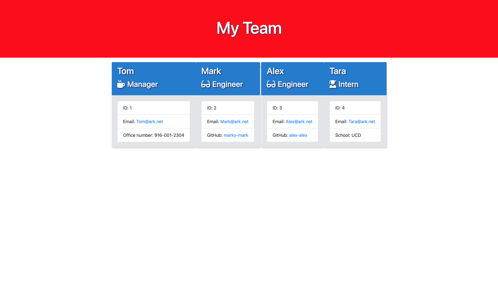
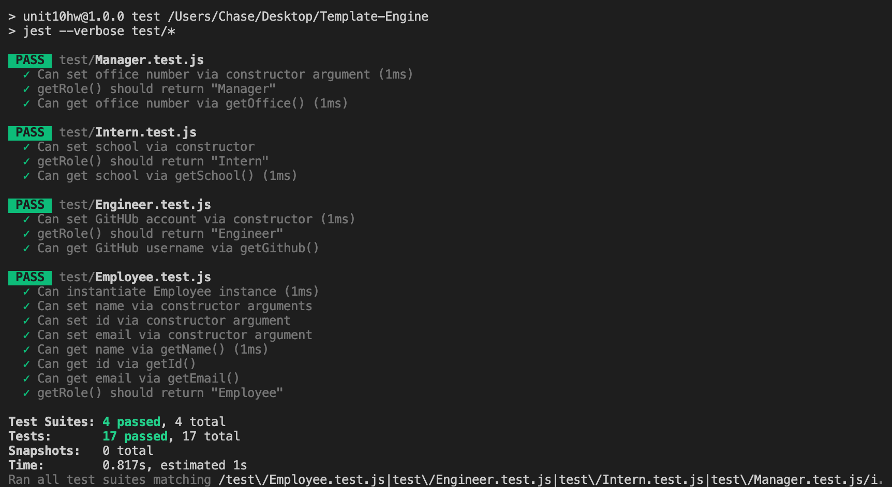

  # Template Engine 
  
  
  
  

  ## Table of Contents
  - [Description](#description)
  - [Installation](#installation)
  - [Usage](#usage)
  - [Licences](#licences)
  - [Contribution](#contribution)
  - [Tests](#tests)
  - [Questions](#questions)
    
  ## Description
  A simple template engine designed to generate a website that displays a team's basic information.
  
  ## Installation

  * open gitbash on Windows or Terminal on Mac
  * https://github.com/chaseyb/Template-Engine.git

  ## Usage
  Open README-Generator in Terminal/CLI, and enter:


  ```
  npm install
  node index.js 
  ```
          
  ## Licences 
  
  
  ## Contributors
  Chase Johnson  
          
  ## Contribution
  Collaborate
            
  ##  Tests
  ```
  npm run test
  ```
  >
  
  ## Video Demo 

  [Youtube link](https://www.youtube.com/watch?v=tKgKmIJTI1k&feature=youtu.be "Youtube Link")

  ## Questions?
  * [Chaseyb](https://github.com/Chaseyb)
  * <Chase.b.johnson@gmail.com>

  
  
 
  
    
